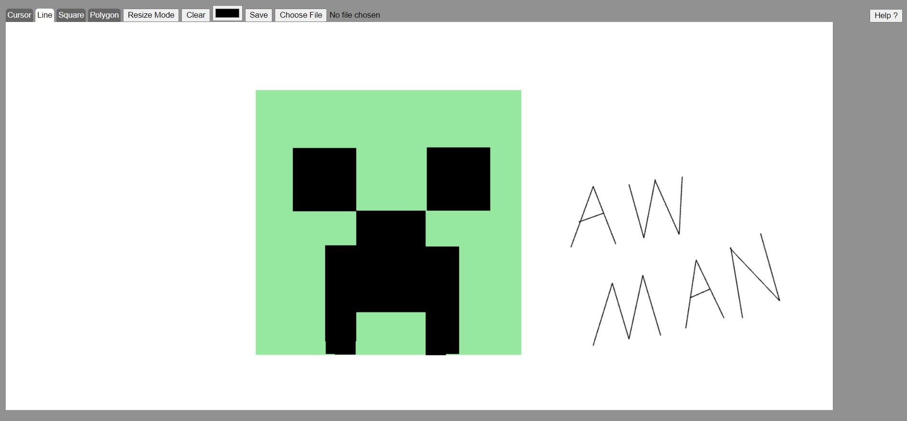

# Paint

## Description
A WebGL Project about architecture blueprint.

## Tech Requirements
In order to open the program, you will need a browser that is compatible with WebGL. 

## How to Use
Open `src/screen.html` in your browser. You should be greeted with a blank canvas.

## User Manual
Please refer to the pdf file in the `docs` folder to see the user manual

## Contributors
NIM | Nama 
--- | ---
13518120 | Yonatan Viody
13518135 | Gregorius Jovan Kresnadi
13518150 | Stephen Thajeb